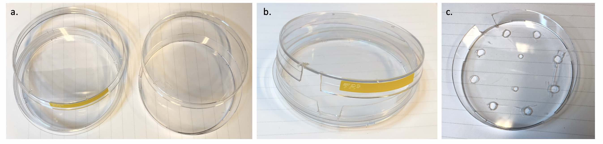
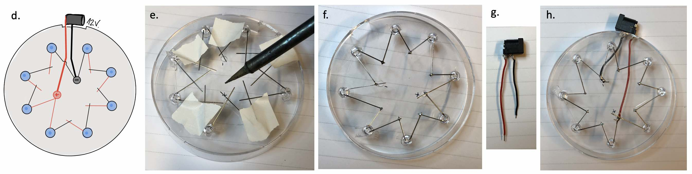
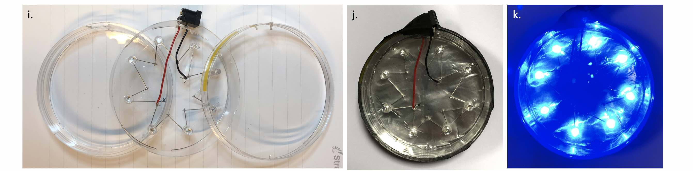
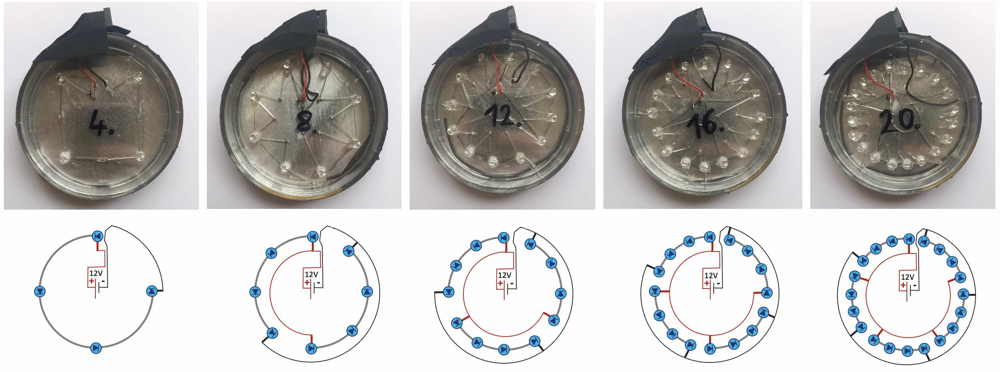
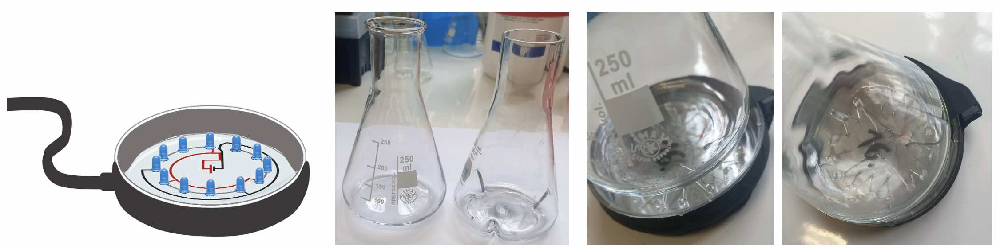

# Opto Flasks
To illuminate flasks (250 mL flasks used in the study).  

___
**Illumination stands construction**:  

The illuination stand is made of 2 nested petri dishes (a.), a slightly bigger one to encase the electronics components (base + lid), a slighty smaller one where holes are drilled to hold LEDs in place (base only - c.). All petri dish parts are cut for a power socket to be positioned on the outside of the plates (b., c.).  
 

In practice, LEDs are connected (soldered) via their leads (long and short) in series of four (e., f.), and only a few wires are needed to connect to the power socket (g., h.).   
 

Once the bases are nested, the lid is put on (i.).  There, using black tape, everyting is held tight together (j.).  
 

___
**SUPPLEMENTARY FIGURE S3:**  
A number of LEDs are arranged in circle to line up with the rotating medium in a shaking incubator.  
LEDs are arranged in series of 4 so that each receives 20mA.   
 
Flasks are placed on top of those illumination stands and held together in metallic holders + lab tape.    

