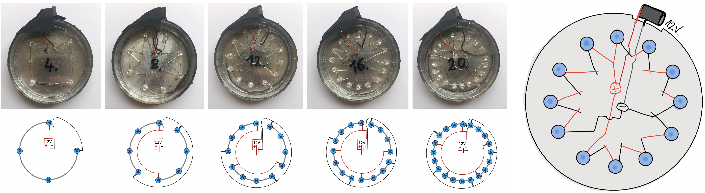
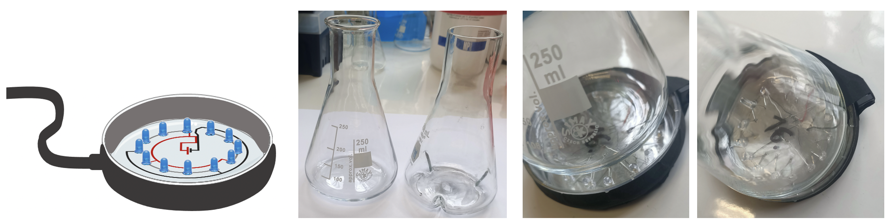

# Opto Flasks
To illuminate flasks (250 mL flasks used in the study).  

___
**ILlumination stands: TUTORIAL TO COME** ...
___
**SUP FIG S3**  
A number of LEDs are arranged in circle to line up with the rotating medium in a shaking incubator.  
LEDs are arranged in series of 4 so that each receives 20mA. 

Flasks are placed on top of those illumination stands and held together in metallic holders + lab tape. 

