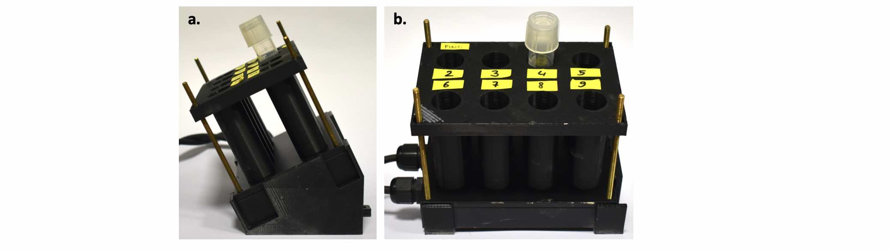
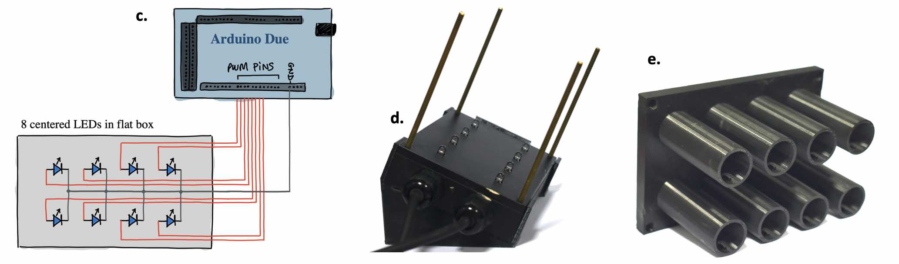

# Opto Tubes
For illumination of 14mL tubes. </br>
It is made of a simple LED array controlled by an Arduino, programmed in C++ (via the [Arduino IDE](https://www.arduino.cc/en/software)). </br>
The device is composed of a base (see STL file), which holds a box in which LEDs are encased, onto which is positioned an adapter carrying the culture tubes (see STL file and Fig.S2e below). </br>

___
**SUPPLEMENTARY FIGURE S2**: </br></br>
</br></br>
</br></br>

___
Example code to run on Arduino (8 LEDs with intermediate intensities for constant illumination):</br>
(see "Arduino_script_example_8LEDs.txt")</br>
```
void setup() {
  pinMode(LED_BUILTIN, OUTPUT);
}

void loop() {
  analogWrite(2, 10);
  analogWrite(3, 35);
  analogWrite(4, 50);
  analogWrite(5, 75);
  analogWrite(6, 100);
  analogWrite(7, 150);
  analogWrite(8, 200);
  analogWrite(9, 255);
}
```
