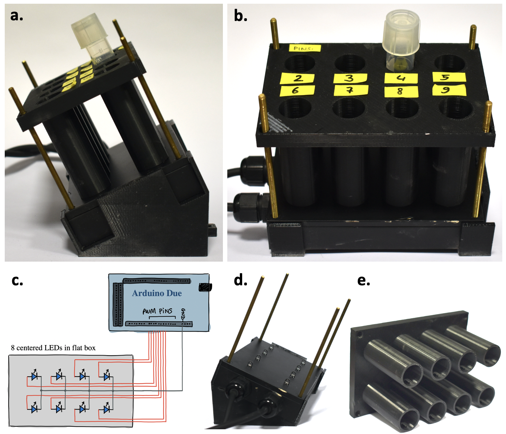

# Opto Tubes
For illumination of 14mL tubes.  
It is made of a simple LED array controlled by an Arduino, programmed in C++ (via the [Arduino IDE](https://www.arduino.cc/en/software)).  
The device is composed of a base (see STL file), which holds a box in which LEDs are encased, onto which is positioned an adapter carrying the culture tubes (see STL file and Fig.S2e below).  

___
**SUPPLEMENTARY FIGURE S2**:

